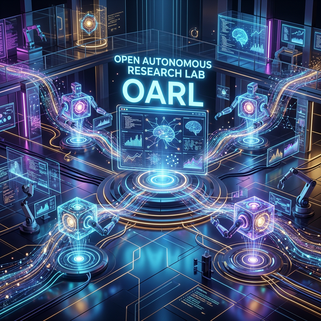

# 🔬 Open Autonomous Research Lab (OARL)

<div align="center">
  
</div>

[](https://github.com/oarl/open-autonomous-research-lab/actions)
[](https://www.python.org/downloads/)
[](LICENSE)

**A multi-agent AI platform for autonomous data analysis, ML experimentation, research discovery, and report generation.**

OARL provides a team of 9 specialized AI agents that collaborate to analyze datasets, train models, evaluate results, and produce comprehensive research reports — all from a single natural-language request.

---

## ✨ Key Features

| Feature | Description |
|---------|-------------|
| **🤖 9 Specialist Agents** | Orchestrator, Planner, Data Engineer, Data Scientist, ML Engineer, Research Analyst, Evaluation, Knowledge Manager, Infrastructure |
| **🧩 100+ Skills** | Modular skill library spanning data engineering, data science, ML, visualization, research, evaluation, and infrastructure |
| **🔧 7 MCP Servers** | Python execution, filesystem, database, visualization, web search, dataset registry, notebook management |
| **🧠 Memory System** | Vector store (ChromaDB), knowledge base, experiment archive |
| **📊 MLflow Integration** | Automatic experiment tracking and comparison |
| **🌐 REST API** | FastAPI backend to trigger workflows programmatically |
| **🖥️ Streamlit UI** | Interactive research interface with dataset upload and report generation |
| **🐳 Docker Ready** | Full containerization with Docker Compose |

---

## 🚀 Quick Start

### Prerequisites

- Python 3.12+
- [uv](https://docs.astral.sh/uv/) package manager

### Installation

```bash
# Clone the repository
git clone https://github.com/oarl/open-autonomous-research-lab.git
cd open-autonomous-research-lab

# Install dependencies
uv sync

# Generate demo datasets
uv run python scripts/generate_datasets.py

# Copy and configure environment
cp .env.example .env
```

### Run the API

```bash
uv run uvicorn src.api.main:app --reload --port 8000
# Visit: http://localhost:8000/docs
```

### Run the UI

```bash
uv run streamlit run src/ui/app.py
# Visit: http://localhost:8501
```

### Run with Docker

```bash
docker compose up -d
# API: http://localhost:8000
# UI:  http://localhost:8501
# MLflow: http://localhost:5000
```

---

## 🏗️ Architecture

```
User Interface (Streamlit) ──→ REST API (FastAPI)
                                    │
                         Agent Orchestration Layer
                    ┌───────────────┼───────────────┐
                    │               │               │
              Planner Agent   Data Engineer   ML Engineer
                    │               │               │
                         Skill Execution Layer
                    ┌───────────────┼───────────────┐
                    │               │               │
              100+ Skills     MCP Tool Layer    Memory System
```

Agents use a **plan → execute → evaluate → improve** reasoning loop.

---

## 📡 API Usage

```bash
# Trigger an analysis pipeline
curl -X POST http://localhost:8000/api/analyze \
  -H "Content-Type: application/json" \
  -d '{"request": "Analyze customer churn patterns", "dataset_path": "datasets/customer_churn.csv", "target_column": "churn"}'

# List available agents
curl http://localhost:8000/api/agents

# Check health
curl http://localhost:8000/health
```

---

## 🧪 Testing

```bash
# Run all tests
uv run pytest tests/ -v

# Run with coverage
uv run pytest tests/ -v --cov=src

# Lint
uv run ruff check src/

# Type check
uv run mypy src/ --ignore-missing-imports
```

---

## 📁 Repository Structure

```
src/
├── agents/          # 9 specialist agents with reasoning loops
├── skills/          # 100+ modular skills across 7 domains
├── mcp_servers/     # 7 MCP tool servers
├── memory/          # Vector store, knowledge base, archive
├── evaluation/      # Metrics, MLflow tracking
├── api/             # FastAPI REST endpoints
├── ui/              # Streamlit research interface
├── observability/   # Structured logging
└── config/          # Pydantic settings
```

---

## 📄 License

[MIT](LICENSE)
